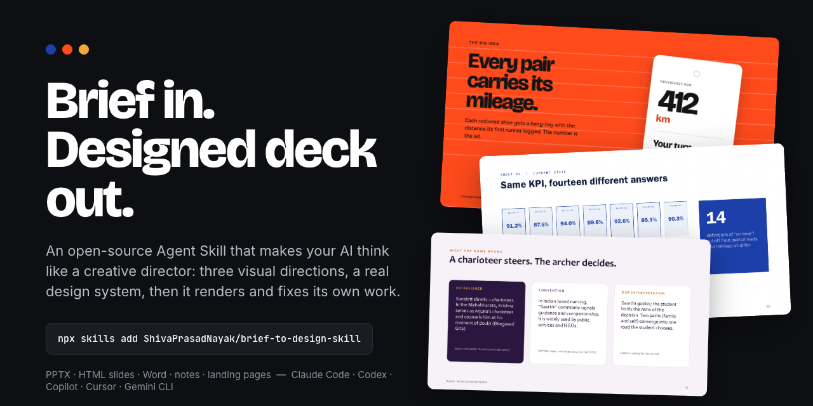
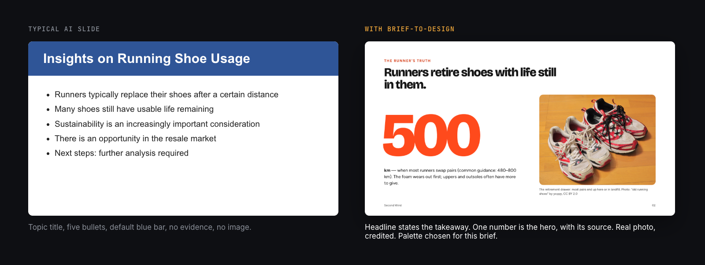
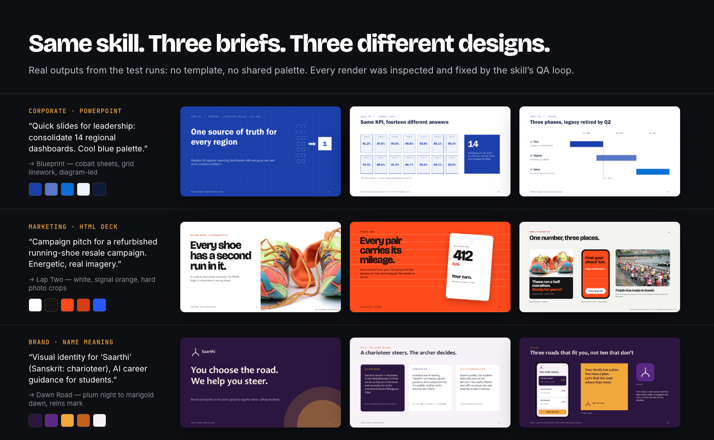
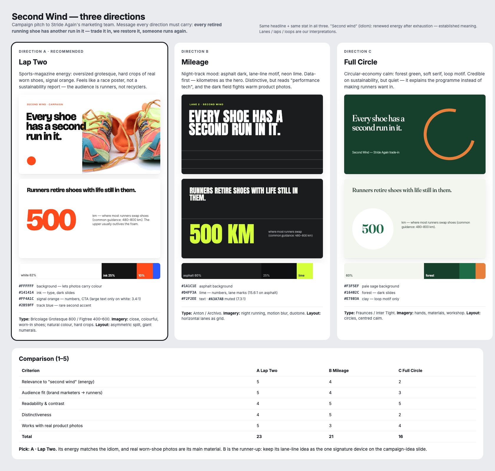
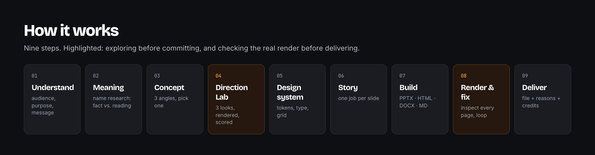
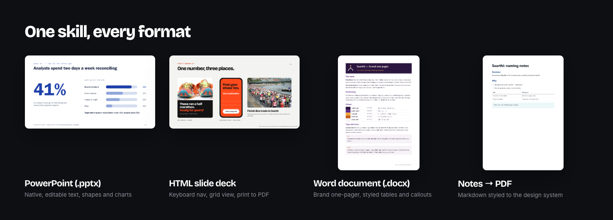

# Brief to Design: the AI design skill for presentations, documents and pages



**Brief to Design** is a free, open-source **Agent Skill** (a `SKILL.md` package) that makes your AI assistant work like a creative director. Give it a brief or a page of notes and it delivers a designed **PowerPoint (PPTX)**, **HTML slide deck**, **Word document**, styled notes or **landing page**. Before it designs, it works out what the subject means. It then explores three visual directions with real colour palettes, sets a design system, builds the file, and renders and fixes its own output before it hands anything over.

It works with **Claude Code, Claude.ai, OpenAI Codex, GitHub Copilot, Cursor, Gemini CLI** and any agent that reads the [Agent Skills](https://agentskills.io) format.

[](LICENSE)


## Install in 10 seconds

```bash
npx skills add ShivaPrasadNayak/brief-to-design-skill
```

That one command installs it for most agents. Prefer a manual install, or using Claude.ai, ChatGPT or Grok? See **[docs/INSTALL.md](docs/INSTALL.md)**.

| Tool | Quick install |
|---|---|
| **Claude Code** | `/plugin marketplace add ShivaPrasadNayak/brief-to-design-skill`, then `/plugin install brief-to-design@brief-to-design-skill` |
| **Claude Code** (manual) | copy `skills/brief-to-design` to `~/.claude/skills/` |
| **OpenAI Codex** | copy `skills/brief-to-design` to `~/.codex/skills/`, or ask Codex: `$skill-installer` + this repo's `skills/brief-to-design` URL |
| **GitHub Copilot** | copy to `~/.copilot/skills/` (personal) or `.github/skills/` (one repo) |
| **Cursor · Gemini CLI · OpenCode** | copy to `~/.agents/skills/` |
| **Claude.ai** | upload [`dist/brief-to-design.zip`](dist/brief-to-design.zip) in *Customize → Skills* |

Then just ask:

> *"Make quick slides to present this idea to my team."*
> *"Explore three visual identities for my brand, Kairos."*
> *"Turn these notes into a polished one-page Word brief."*

## Why it exists

Most AI slides look the same: a topic title, five bullets, a default blue bar. This skill makes the AI think like a design studio instead.



## Same skill, three briefs, three different designs

These are real outputs from the test runs; open them in [`examples/outputs`](examples/outputs). No template, no shared palette. Each design comes from its brief.



| Brief | What the skill decided | File |
|---|---|---|
| "Quick slides for leadership: consolidate 14 regional dashboards. Cool blue palette." | **Blueprint**: cobalt sheets with grid linework, diagram-led, because the idea is a platform you *build* | [PPTX](examples/outputs/meridian-platform-proposal.pptx) |
| "Campaign pitch for a refurbished running-shoe resale campaign. Energetic, real imagery." | **Lap Two**: white, signal orange, hard crops of worn shoes. Energy to match the idiom "second wind" | [HTML deck](examples/outputs/second-wind-html/index.html) |
| "Visual identity for 'Saarthi' (Sanskrit: charioteer), AI career guidance for students." | **Dawn Road**: plum night to marigold dawn, a mark of two reins joining one road. "A charioteer steers. The archer decides." | [PPTX](examples/outputs/saarthi-brand-concept.pptx) · [DOCX](examples/outputs/saarthi-brand-onepager.docx) |

## What it does

- **Understands before it designs.** Audience, purpose, the one message, and what the name or title means. It looks up a name's origin and keeps *sourced fact*, *design convention* and *creative interpretation* separate, so it never invents a backstory.
- **Direction Lab.** Three genuinely different looks (palette, typography, imagery, composition), rendered side by side with the same real content, scored, and one picked with a reason.
- **Colour that has a reason.** Role-based palettes (background, text, primary, accent and so on) with HEX values, proportions and a built-in WCAG contrast checker that suggests fixes.
- **A real design system.** Tokens, type scale, grid and components. For web builds it doubles as a developer handoff spec.
- **Story first.** One job per slide, headlines that state the takeaway, and a clear ask at the end.
- **Builds the actual file.** Editable PPTX (native text, shapes and charts, not flat images), keyboard-driven HTML decks, Word documents, Markdown notes, landing pages.
- **Looks at its own work.** Renders every page to images, hunts for overflow, collisions, low contrast and dead space, fixes them and renders again.
- **Honest assets.** Openly licensed photos with credits recorded automatically, no fake logos, concept marks labelled as concepts.



## How it works



1. **Understand** the audience, purpose and message.
2. **Meaning**: research the name or title (sourced fact vs. interpretation).
3. **Concept**: three narrative angles, pick one.
4. **Direction Lab**: three rendered looks, scored.
5. **Design system**: colour tokens, type, grid, components.
6. **Story plan**: one job per slide or section.
7. **Build** the PPTX, HTML, DOCX, MD or page.
8. **Render and fix**: inspect every page, loop until clean.
9. **Deliver** the file, the reasoning in two lines, fonts needed and image credits.

**Fast mode** ("quick slides for tomorrow") keeps the exploration in a short table and decides on its own. **Explore mode** ("show me options") renders the lab and lets you pick.

## Every format



| Format | Built with | Checked with |
|---|---|---|
| PowerPoint `.pptx` | [pptxgenjs](https://gitbrent.github.io/PptxGenJS/) + included helper kit | PowerPoint export (macOS) or LibreOffice |
| HTML slide deck | included deck shell (1920×1080, keys, grid view, print to PDF) | headless Chrome + automatic overflow QA |
| Word `.docx` | [docx](https://docx.js.org/) | Word export (macOS) or LibreOffice |
| Notes / one-pager | Markdown + included stylesheet | pandoc + Chrome to PDF |
| Landing page / site | single HTML file | full-page desktop and mobile screenshots + QA |

## Requirements

The skill runs inside your AI tool; its helper scripts need:

- **Node.js 18+** (pptxgenjs and docx are installed locally per project, never globally)
- **Python 3.9+** with Pillow (`pip install pillow`); optional `websocket-client` for HTML overflow checks
- **Google Chrome, Chromium or Microsoft Edge** for HTML rendering
- **Microsoft Office (macOS)** or **LibreOffice** (any OS) to render PPTX/DOCX for inspection
- `pandoc` and `pdftoppm` (poppler) for notes and page images

No API keys. No paid services. Image search uses the free [Openverse](https://openverse.org) API.

## What's inside

```
skills/brief-to-design/
├── SKILL.md                 workflow, modes, non-negotiables
├── references/              colour, meaning & story, layout & type, imagery, formats, quality gates, quality bar
├── templates/               creative brief, design system, Direction Lab board, HTML deck shell, pptx kit, notes.css
├── scripts/                 render.py (any format to page images + QA), contrast.py (WCAG), fetch_image.py (licensed photos)
└── examples/                three fully worked test runs
```

## FAQ

**What is an Agent Skill?**
A folder with a `SKILL.md` file (instructions plus metadata) and optional scripts and references. AI agents load it automatically when a request matches its description. The format is an open standard supported by Claude, Codex, Copilot, Cursor, Gemini CLI and others.

**Does it make editable PowerPoint files?**
Yes. Slides use native PowerPoint text boxes, shapes, tables and charts, so you can edit everything after delivery. It never flattens slides into pictures.

**Does it work in ChatGPT or Grok?**
Where your plan supports Skills, upload the zip. Elsewhere, add `SKILL.md` and the `references/` files to a Project as knowledge. The design method works there, but the render-and-fix scripts need a tool that can run code (Claude Code, Codex, Copilot agent mode, Cursor).

**Will it use my brand colours and fonts?**
Yes. Anything you specify wins. The Direction Lab then explores composition and typography around your choices.

**Is it free for commercial use?**
The skill is MIT licensed. Photos it finds come from openly licensed sources and their credits are saved to `CREDITS.json`. Follow those licences in your own work.

**Which fonts does it use in PowerPoint?**
By default, fonts bundled with Microsoft Office on both Mac and Windows (for example Franklin Gothic, Candara, Gill Sans MT), so decks look the same on any machine. Web decks use Google Fonts.

## Share what you make

Built something with it? Post it in [Discussions → Show and tell](../../discussions/categories/show-and-tell) or tag **#BriefToDesign**. Good examples get featured in this README with credit.

## Contributing

Issues and pull requests are welcome; see [CONTRIBUTING.md](CONTRIBUTING.md). The most useful contributions are new worked examples, renderer support for more platforms, and palette or layout references.

## Credits and license

Created by **[Shiva Prasad Nayak](https://github.com/ShivaPrasadNayak)**. MIT License, see [LICENSE](LICENSE).

Photos in the sample marketing deck and images: "Running Shoes" by timtak (CC BY 2.0), "old running shoes" by yoppy (CC BY 2.0), "2015EUNAP68" by Európa Pont (CC BY 2.0), via Openverse/Flickr. Full credits are in [`examples/outputs/second-wind-html/assets/CREDITS.json`](examples/outputs/second-wind-html/assets/CREDITS.json). Sample brands (Meridian Freight, Stride Again, Saarthi) are fictional concepts made for testing.
